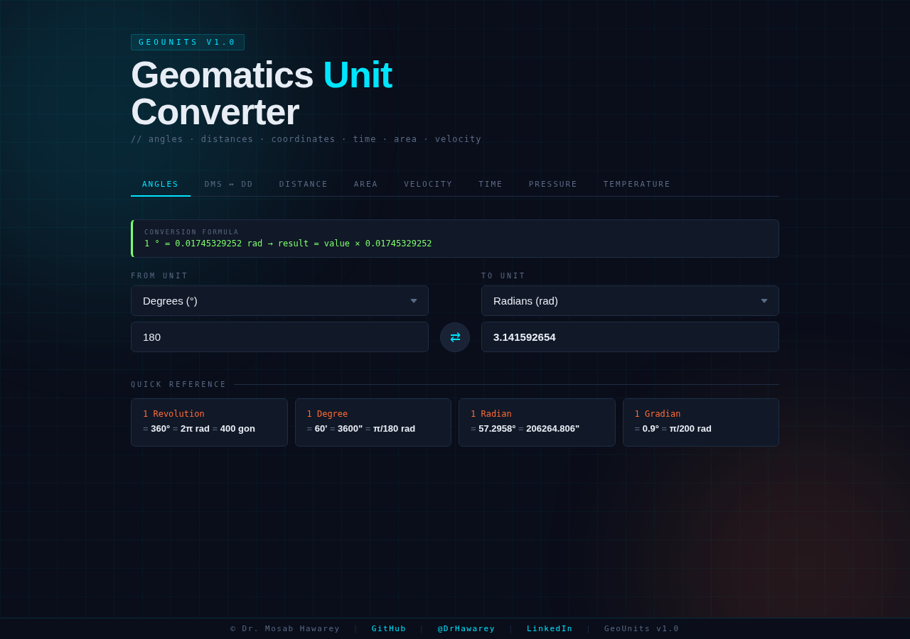

# GeoUnits — Geomatics Unit Converter

[](https://opensource.org/licenses/MIT)

A professional, browser-based unit converter tailored for geodesists, surveyors, GIS engineers, and remote sensing specialists. No dependencies, no build step — just open `index.html`.



## Features

- **8 conversion categories** with geodesy-specific units
- **Live formula bar** showing the exact conversion factor used
- **Swap button** to instantly reverse conversion direction
- **Quick reference cards** with geodetic and orbital constants
- Zero dependencies — pure HTML, CSS, and JavaScript

## Categories & Units

| Category | Units |
|---|---|
| **Angles** | Degrees, Radians, Gradians (gon), Arcminutes, Arcseconds, Milliarcseconds, Revolutions |
| **DMS ↔ DD** | Degrees/Minutes/Seconds ↔ Decimal Degrees (with hemisphere) |
| **Distance** | m, km, cm, mm, ft, in, mi, Nautical Miles, Yards, Chains, Links, Fathoms, AU, Light Years |
| **Area** | m², km², cm², Hectares, Acres, ft², mi², yd², Square Chains |
| **Velocity** | m/s, km/h, mph, Knots, ft/s, Mach, Speed of Light |
| **Time** | ns, μs, ms, s, min, hr, day, week, Julian Year, Sidereal Day, Solar Day |
| **Pressure** | Pa, hPa, kPa, MPa, Bar, mbar, atm, PSI, mmHg, inHg |
| **Temperature** | Celsius, Fahrenheit, Kelvin, Rankine |

## Usage

### Local
```bash
# Just open in any browser
open index.html
```

## Geodetic Constants Included

- 1 Nautical Mile = 1852 m (= 1 arcminute of latitude)
- 1 Gunter's Chain = 20.1168 m = 100 links
- Standard Atmosphere = 1013.25 hPa = 101,325 Pa
- Sidereal Day = 86,164.1 s (23h 56m 4.1s)
- Julian Year = 365.25 days = 31,557,600 s
- GPS Epoch = January 6, 1980 00:00:00 UTC
- LEO orbital velocity ≈ 7,800 m/s

## Author

**Dr. Mosab Hawarey**
>
PhD, Geodetic & Photogrammetric Engineering (ITU) | MSc, Geomatics (Purdue) | MBA (Wales) | BSc, MSc (METU)

- GitHub: https://github.com/mhawarey
- Personal: https://hawarey.org/mosab
- ORCID: https://orcid.org/0000-0001-7846-951X

## License

MIT License
